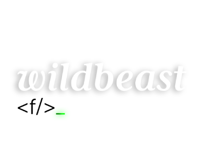
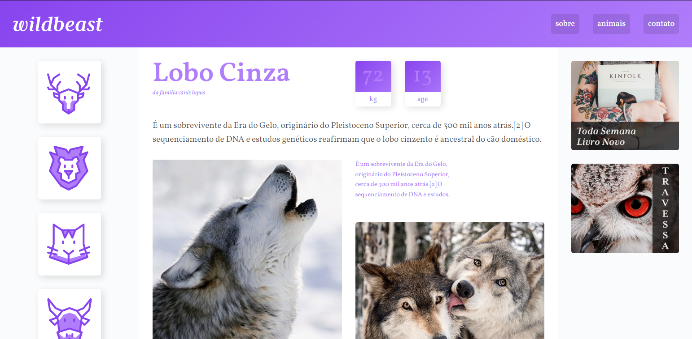

</img>
<h1>Project: WildBeast</h1>

The project is a website about animals, very simple, it was developed with the aim of testing my skills in CSS GRID Layout, it is also responsive.

O projeto é um site sobre animais, bem simples, ele foi desenvolvido com o objetivo de testar minhas habilidades em CSS GRID Layout, ele também está responsivo.

</img>

Versão Mobile

</img>
</img>

Technologies Used

<button class="tech html">HTML</button>
<button class="tech css">CSS</button>
<button class="access"><a href="">Access here</a></button>